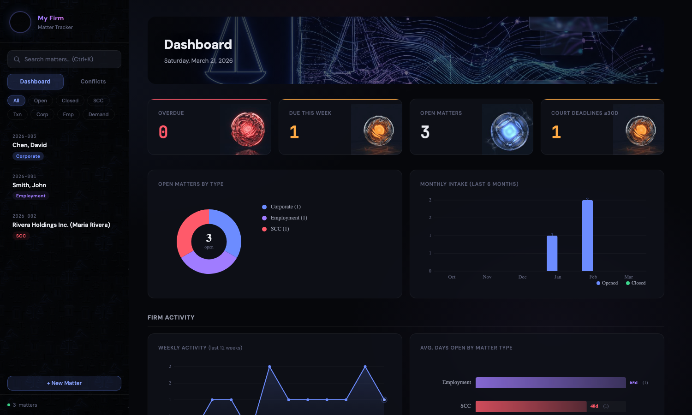

# Lawyered Matter Tracker (Clio Edition)

A practice management system for solo and small law firms, powered by [Claude](https://claude.ai), with one-way sync to [Clio Manage](https://www.clio.com/ca/clio-manage/).

This is the **Clio-integrated variant** of [`lawyered-matter-tracker`](https://github.com/lawyered0/lawyered-matter-tracker). Everything the main repo does, plus: when you open a new matter, Claude automatically creates (or reuses) the contact in Clio and creates the matter — configuring it as a flat-fee matter in one call when you specify a fee, all without leaving the conversation. The tracker remains the source of truth; Clio is a downstream projection.

If you don't use Clio, use the [plain version](https://github.com/lawyered0/lawyered-matter-tracker) instead.

- You have client folders and an Excel spreadsheet — that's your local CRM
- Instead of clicking through Clio for every new matter, you talk to Claude
- **"New matter Smith, flat fee $1,500"** — searches your Gmail and client folders, builds a timeline, runs a conflict check, adds the matter to your tracker, **creates the contact + flat-fee matter in Clio** (one-call setup via `custom_rate`)
- **"Daily triage"** — scans your inbox, matches emails to open matters, flags court deadlines, and tells you what needs attention
- **"Let's work on Smith"** — loads the full context for a matter so you can pick up mid-conversation where the last session left off
- **"Update matter Smith"** — pulls new emails and documents since the last update, merges them into the timeline *(does not touch Clio — Clio sync only runs on new matters)*
- Everything important stays local — no cloud database, no SaaS lock-in for your tracker; Clio is used for its strengths (billing, trust, invoicing) without re-entry



## Prerequisites

- [Claude Desktop](https://claude.ai/download) or [Claude Code](https://docs.anthropic.com/en/docs/claude-code)
- **Gmail MCP server** connected — the skills pull emails to build timelines and run triage. Without it, the skills still work but fall back to folder-only scanning.
- **Google Calendar MCP server** connected *(optional, for calendar-sync)* — pushes limitation dates, court deadlines, and follow-ups to a dedicated "Key Dates" Google Calendar.
- **[clio-mcp](https://github.com/lawyered0/clio-mcp) server** connected — this is the custom MCP that bridges Claude ↔ Clio Manage. Follow the setup in that repo to install it and authorize it against your Clio workspace. Without it, new-matter workflow still creates the tracker row — it just skips the Clio step.

## Setup

### 1. Install the Clio MCP server

Follow the instructions in [lawyered0/clio-mcp](https://github.com/lawyered0/clio-mcp) to install and authorize the Clio MCP server. You'll need:

- A Clio developer app (free) with OAuth redirect configured
- The `CLIO_CLIENT_ID`, `CLIO_CLIENT_SECRET`, and an initial refresh token
- The MCP added to your Claude Desktop / Claude Code config

Verify the connection by asking Claude "who am I in Clio?" — if the `clio-mcp` server responds with your Clio user details, you're wired up.

### 2. Install the skills

Install the five skills from this repo through Claude's UI, or import them from the `skills/` directory.

### 3. Configure your Clio user id

The `matter-tracker` skill references a Clio user id when creating matters (for the responsible and originating attorney fields). Find yours by asking Claude "who am I in Clio?" via the clio-mcp server, then paste it into `CLAUDE.md` under `CLIO_USER_ID` (see the CLAUDE.md template in this repo).

### 4. Set up your client directory

Your client directory should look like this — each client gets a subfolder:

```
My Client Files/
├── CLAUDE.md              ← copy from this repo, edit for your jurisdiction
├── matter-tracker.xlsx    ← the tracker (created automatically on first use)
├── Smith, John/           ← client folder
├── Rivera Holdings/       ← client folder
└── ...
```

Copy `CLAUDE.md` from this repo into your client files directory and edit it to fill in your firm name, initials, court email domains, and limitation statutes for your jurisdiction.

### 5. Start working

Open Claude Desktop (or run `claude` from the CLI) with your client files directory as the working directory. Then just say things like:

- "Run the daily triage"
- "Open a new matter for Smith v Jones, flat fee $1,500" *(creates a flat-fee matter in Clio in one call)*
- "Let's work on the Garcia file"
- "Update the timeline for matter 2026-003"
- "Run a conflict check for Acme Corp"

The tracker spreadsheet is created automatically the first time you open a new matter.

## What Clio Sync Does (and Doesn't Do)

**On `new matter`, Claude will:**
1. Search Clio for a contact matching the client name. If found, reuse it. If not, create a new Clio contact (company or person, inferred from the tracker's Client Name column).
2. Create a new Clio matter under that contact — passing `flat_rate_amount` when a fee is known so the matter is set up as flat-fee in a single call (Clio flips `billing_method` to `"flat"` and auto-creates the billable line item).
3. Report the Clio contact ID, matter ID, and flat fee back to you.

**It will NOT:**
- Read Clio data back into the tracker — sync is one-way. Tracker is source of truth.
- Touch Clio on `update matter` or `close matter` — only `new matter` triggers Clio sync. If you change a matter in Clio, that's fine; the tracker doesn't care.
- Persist Clio IDs in the tracker — future syncs look up by client name. (If duplicate-name collisions become a problem, an optional Clio ID column can be added to the schema.)

**Known Clio API quirk:** Setting `billing_method` directly at the matter root is silently ignored by Clio's API — but flat-fee billing **is** settable via the nested `custom_rate` association. The `clio-mcp` server handles this automatically when you pass `flat_rate_amount` to `clio_create_matter`: it POSTs the matter, then PATCHes `custom_rate` so Clio flips `billing_method` to `"flat"` and auto-creates a billable line item for the fee. The matter displays correctly as flat-fee in Clio reports.

**If Clio MCP is unavailable** (server down, auth expired, etc.), the tracker write still commits and the Clio failure is logged to you. The system degrades cleanly — no lost work.

## How It Works

Five Claude skills handle the core workflows:

| Skill | What It Does |
|-------|-------------|
| `daily-triage` | Scans Gmail for new emails, matches them to open matters, surfaces urgent items, auto-fills missing tracker fields, and presents a prioritised triage summary |
| `matter-tracker` | Opens, updates, and closes matters by pulling from Gmail + client folder files to build timelines. Runs conflict checks, tracks limitation periods, and maintains the Excel tracker |
| `work-on-matter` | Loads context for an existing matter at the start of a work session — reads the tracker row + three per-matter files (brief, decisions log, comms) with a mandatory email refresh so you always pick up from current state. Includes source-first drafting, pre-send sourcing checks, an instruction ledger for substantive drafts, a privilege screen on outbound communications, and prior-matter fact discipline |
| `calendar-sync` *(helper)* | Pushes limitation dates, court deadlines, and follow-ups to a dedicated "Key Dates" Google Calendar. Invoked internally by `matter-tracker` and `work-on-matter` — not user-facing. Requires a Google Calendar MCP server |
| `overdue-triage` | The periodic deep sweep. Reviews every open matter for past-date items across Next Action (col I), Limitation Deadline (col R), and Court Deadlines (col S); investigates each, confirms with you one item at a time, and applies approved changes in a single batched write. Meant to run every few weeks |

### Daily Triage
Searches Gmail for recent emails, matches them against open matters by name/email/keyword, classifies urgency (court emails are always urgent), and presents a scannable summary. Auto-fills missing contact info when confident. Categorises unmatched emails into: active matters not yet tracked, new client inquiries, leads, and non-legal.

### Matter Tracker
The CRM engine. "New matter Smith" triggers a full Gmail search + folder scan, builds a timeline with a SUMMARY header, runs a conflict check, adds the matter to the spreadsheet, **and syncs the contact + flat-fee matter to Clio in a single call**. "Update matter Smith" pulls new activity since the last update (tracker only — no Clio touch). "Close matter Smith" finalises and archives (tracker only). Always confirms before writing.

### Work on Matter
Fast context loading with a mandatory email refresh. "Let's work on Smith" reads the tracker row and three per-matter files from the matter folder: a current-state brief (`_matter-brief.md`), a strategic decisions log (`_matter-decisions.md`), and a client communications/preferences file (`_matter-comms.md`). On every load, the skill pulls the past 7 days from Gmail and merges any material findings into the brief before orienting — no more stale context. As you do substantive work (review documents, draft letters, give advice), the skill saves to whichever file the content belongs in and updates the tracker inline so the next session can pick up instantly. Includes source-first drafting guardrails (every dollar figure, section reference, and party name gets confirmed against the source document before it lands in client-facing output), a privilege screen that catches internal reasoning bleeding into outbound comms, and a prior-matter fact discipline that requires three-source verification before categorical statements about past firm involvement.

### Calendar Sync *(helper, not user-facing)*
Projects the tracker onto a dedicated Google Calendar. Court deadlines, limitation dates, follow-ups, and third-party pings each get a colour-coded event with a 14/7/2/0-day reminder schedule. The tracker is the source of truth; the calendar is a read-only projection.

### Overdue Triage
The monthly (or quarterly) sweep. Walks every open matter, finds past-date items in the deadline columns, searches Gmail and the matter folder to figure out which ones were actually dealt with, and confirms each one with you before a single batched write. Items that look genuinely unresolved get surfaced as a red-flag list with suggested next actions.

## Spreadsheet Schema

The tracker uses two sheets ("Open Matters" and "Closed Matters") with these columns:

| Col | Header | Purpose |
|-----|--------|---------|
| A | File # | Auto-assigned `YYYY-NNN` |
| B | Client Name | Format: `Entity (Principal)` |
| C | Matter Description | Brief description |
| D | Status | Open / Closed |
| E | Date Opened | YYYY-MM-DD |
| F | Date Closed | Blank until closed |
| G | Last Activity | Updated on every interaction |
| H | Opposing Party | If applicable |
| I | Next Action / Deadline | Key upcoming step |
| J | Timeline | Substantive SUMMARY header + chronological log |
| K | Client ID Verified | Checkmark or Pending |
| L | Conflict Check Done | Checkmark or Pending |
| M-O | Client Email/Phone/Address | Contact info |
| P | Discovery Date | For limitation tracking |
| Q | Limitation Statute | Dropdown of configured statutes |
| R | Limitation Deadline | Auto-calculated or manual |
| S | Court Deadlines | JSON array of bespoke deadlines |
| T | Matter Folder | Subfolder name for client files |
| U | Other Parties | For conflict check coverage |
| V | Matter Type | Free-text classification (Litigation / Solicitor / Transactional / etc.) |

## Optional: Web Dashboard

The `webapp/` directory contains a Flask web dashboard that reads and writes the same `matter-tracker.xlsx` file. Copy it into your client directory and run:

```bash
pip install flask openpyxl
python app.py
```

Open [http://localhost:5001](http://localhost:5001). This is a supplementary visual tool — the primary workflow is conversational through Claude.

## Author

[@bitgrateful](https://x.com/bitgrateful)

## License

MIT
